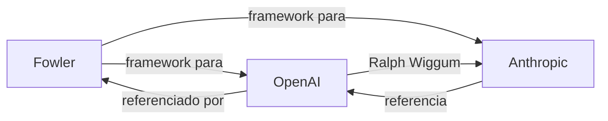

# 🗺️ Fontes

> [!info] Sobre este mapa
> Índice das três fontes primárias do vault. Cada uma contribui com uma
> perspectiva distinta sobre harness engineering.

![[Tracker de Fontes.base]]

## Fontes Primárias

- [[OpenAI - Harness Engineering]] — **foco: ambiente estático**
  Perspectiva de uma equipe operando agentes em produção. Ênfase em
  arquitetura, linters, legibilidade do agente e gestão de entropia.
  Origem: `source/openai`

- [[Anthropic - Harness Design for Long-Running Apps]] — **foco: loops dinâmicos**
  Documentação da evolução de um harness para tarefas autônomas longas.
  Introduz a arquitetura GAN-inspired (Generator-Evaluator) e trata de
  context anxiety e simplificação iterativa.
  Origem: `source/anthropic`

- [[Martin Fowler - Harness Engineering for Coding Agent Users]] — **foco: framework teórico**
  O artigo mais conceitual dos três. Define feedforward/feedback, tipos de
  controle, dimensões de regulação e harnessability. Serve como vocabulário
  comum para o campo.
  Origem: `source/fowler`

## Comparação das perspectivas

| Dimensão | OpenAI | Anthropic | Fowler |
|----------|--------|-----------|--------|
| Foco | Ambiente estático | Loops dinâmicos | Framework teórico |
| Controles | Computacional | Inferencial | Ambos |
| Agentes | Single → multi | Multi (3 agentes) | Agnóstico |
| Maior contribuição | Linters, arquitetura, GC | Generator-Evaluator, context resets | Linguagem e taxonomia |

## Conexões entre fontes

