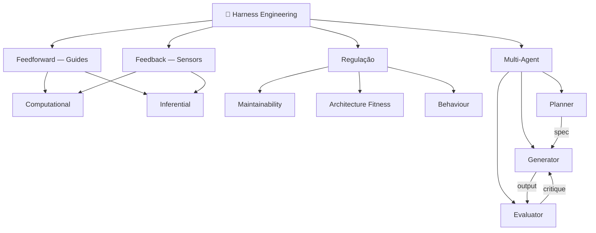

# 🗺️ Harness Engineering

> [!info] O que é Harness Engineering
> Harness Engineering é a disciplina de construir o **ambiente** que circunda
> um modelo de IA — tudo exceto o modelo em si. O harness combina guias
> feedforward (que aumentam a probabilidade de o agente acertar) e sensores
> feedback (que detectam e corrigem erros), regulando o comportamento do
> agente em três dimensões: manutenibilidade, fitness de arquitetura e
> comportamento funcional.

![[Dashboard Principal.base]]

## Fundamentos

- [[Agent = Model + Harness]] — a definição que ancora todo o campo
- [[O que é um Harness]] — o que conta como harness e o que não conta
- [[Feedforward e Feedback]] — os dois mecanismos de controle fundamentais
- [[Controles Computacionais vs Inferenciais]] — determinístico vs semântico
- [[O Steering Loop]] — o papel do humano como arquiteto do harness
- [[Harnessability]] — por que nem todo codebase é igualmente harnesável

## Frameworks de Regulação

- [[Maintainability Harness]] — qualidade interna e manutenibilidade
- [[Architecture Fitness Harness]] — aderência à arquitetura definida
- [[Behaviour Harness]] — correção funcional do sistema

## Padrões Centrais

- [[Padrão Generator-Evaluator]] — separar geração de julgamento
- [[Arquitetura Planner-Generator-Evaluator]] — decomposição em três agentes especializados
- [[Context Resets]] — solução para context anxiety em tarefas longas
- [[Contratos de Sprint]] — alinhamento antes da implementação
- [[Ralph Wiggum Loop]] — iteração contínua via hooks e scripts
- [[Golden Principles]] — invariantes de gosto como guardrails

## Conceitos Avançados

- [[Context Anxiety]] — quando o modelo encerra prematuramente por pressão de contexto
- [[Self-Evaluation Failure Mode]] — por que agentes não se avaliam bem
- [[Entropia e Garbage Collection]] — gerenciamento de drift no codebase
- [[Legibilidade do Agente]] — código deve ser legível para agentes, não só humanos
- [[Timing - Keep Quality Left]] — onde colocar cada controle no ciclo de mudança

## Agentes Especializados

- [[Planner Agent]] — expande prompts em especificações detalhadas
- [[Generator Agent]] — implementa features sprint a sprint
- [[Evaluator Agent]] — valida outputs com critérios concretos

## Fontes Primárias

- [[OpenAI - Harness Engineering]] — foco em ambiente estático, linters, arquitetura
- [[Anthropic - Harness Design for Long-Running Apps]] — foco em loops dinâmicos GAN-inspired
- [[Martin Fowler - Harness Engineering for Coding Agent Users]] — framework teórico completo

## Visão geral de conexões

