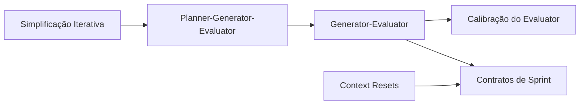

# 🗺️ Padrões

> [!info] Sobre este mapa
> Índice de todos os padrões de implementação do vault, organizados por
> categoria. Padrões são soluções concretas para problemas recorrentes em
> harness engineering.

![[Todos os Padrões.base]]

## Arquitetura Multi-Agente

- [[Padrão Generator-Evaluator]] — separar geração de avaliação, inspirado em GANs
- [[Arquitetura Planner-Generator-Evaluator]] — sistema de três agentes especializados
- [[Autonomia Progressiva]] — expandir o escopo do agente incrementalmente

## Gestão de Contexto e Sessão

- [[Context Resets]] — apagar contexto e reiniciar com artefato de handoff
- [[Contratos de Sprint]] — alinhar generator e evaluator antes de codificar
- [[Simplificação Iterativa do Harness]] — remover componentes desnecessários

## Qualidade e Controle

- [[Padrão Generator-Evaluator]] — loop de refinamento com feedback externo
- [[Calibração do Evaluator]] — few-shot para alinhar julgamento do evaluator
- [[Ralph Wiggum Loop]] — iteração contínua via hooks e scripts
- [[Golden Principles]] — invariantes de gosto codificados como guardrails

## Ambiente e Estrutura

- [[No-Human-Code Philosophy]] — aspiração de zero código escrito por humanos
- [[Repository as System of Record]] — o repo como fonte única de verdade
- [[Arquitetura em Camadas com Domínios]] — separação de domínios com fronteiras claras
- [[Harness Templates]] — templates de harness por topologia de serviço

## Conexões

