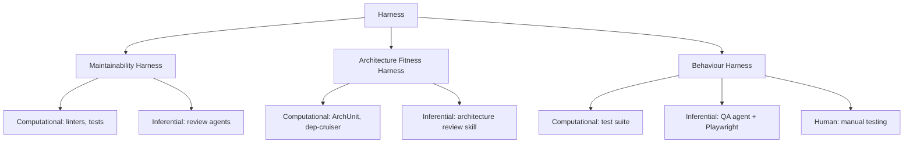

# 🗺️ Regulação

> [!info] Sobre este mapa
> O harness regula o codebase em três dimensões distintas. Distinguir entre
> elas importa porque a harnessability e a complexidade variam em cada uma,
> e a linguagem precisa para discuti-las é diferente.

## As Três Dimensões de Regulação

- [[Maintainability Harness]] — regula a qualidade interna e manutenibilidade
  do código: sem duplicação, complexidade ciclomática, cobertura de testes,
  drift de arquitetura, violações de estilo.

- [[Architecture Fitness Harness]] — regula se o sistema adere às
  características arquiteturais definidas: performance, observabilidade,
  fronteiras de domínio, padrões de API.

- [[Behaviour Harness]] — regula se o sistema funciona corretamente do ponto
  de vista do usuário: features implementadas, edge cases cobertos, bugs ausentes.

## Estado atual de maturidade

| Dimensão | Maturidade | Principal desafio |
|----------|-----------|-------------------|
| Maintainability | Alta | Ferramentas maduras existem (linters, testes) |
| Architecture Fitness | Média | Fitness Functions bem estabelecidas; LLMs ajudam |
| Behaviour | Baixa | **"Elefante na sala"** — ainda não temos boa solução |

## Conceitos relacionados

- [[Feedforward e Feedback]] — os mecanismos que implementam a regulação
- [[Controles Computacionais vs Inferenciais]] — os dois sabores de controle
- [[Harnessability]] — pré-condição para regulação efetiva
- [[Timing - Keep Quality Left]] — quando cada controle deve rodar

