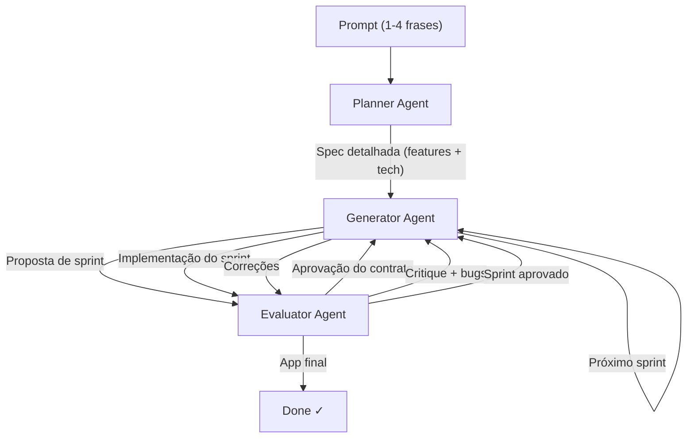

# Arquitetura Planner-Generator-Evaluator

> [!tip] Resumo em uma frase
> Sistema de três agentes onde um Planner expande prompts curtos em specs
> detalhadas, um Generator implementa feature a feature, e um Evaluator valida
> cada sprint com critérios concretos — permitindo tarefas autônomas de alta
> complexidade ao longo de horas.

## Problema

Tarefas complexas de desenvolvimento de software não cabem na capacidade de
um único agente em sessão única:
1. O contexto cresce demais → [[Context Anxiety]]
2. O agente divaga sem planejamento estruturado
3. Não há validação independente do que foi produzido → [[Self-Evaluation Failure Mode]]
4. Sem decomposição, o escopo é subestimado

## Solução

**Planner:**
- Input: prompt de 1-4 frases
- Output: spec detalhada com features, arquitetura high-level, stack técnica
- Foco: escopo e contexto de produto, não detalhes de implementação
- Sem sprints: não micro-gerencia como o generator implementa

**Generator:**
- Input: spec do planner + critérios do evaluator
- Trabalha em sprints: uma feature ou conjunto coerente por vez
- Negocia contratos de sprint com o evaluator antes de codificar
- Se auto-avalia brevemente ao final de cada sprint antes de passar ao QA

**Evaluator:**
- Input: sprint contract + acesso ao app rodando
- Usa ferramentas para interagir com o app (Playwright MCP)
- Avalia contra critérios concretos com thresholds
- Sprint falha se qualquer critério cai abaixo do threshold
- Produz critique detalhada e acionável

## Forças e trade-offs

| Força | Descrição |
|-------|-----------|
| ✅ Lida com tarefas longas | Sprints + (em versões antigas) context resets |
| ✅ Validação independente | Evaluator separado evita self-evaluation failure |
| ✅ Spec gerada automaticamente | Planner expande prompts pobres em specs ricas |
| ✅ Contratos de sprint | Alinhamento antes de codificar evita retrabalho |
| ⚠️ Custo muito alto | Runs de 4-6h, $100-200 em tokens |
| ⚠️ Complexidade de orquestração | Três agentes + comunicação via arquivos |
| ⚠️ Requer simplificação contínua | O harness envelhece com novos modelos |

## Quando usar

- Desenvolvimento de aplicação completa a partir de prompt curto
- Tarefas que excedem a capacidade de um único agente em sessão única
- Quando qualidade de output justifica custo de tempo e tokens
- Pesquisa e desenvolvimento de novos tipos de harness

## Quando não usar

- Features individuais ou tarefas bem definidas
- Quando o modelo é capaz o suficiente para completar a tarefa solo
- Orçamentos de tempo/custo restritos

## Exemplos das fontes

> [!example] Anthropic — Game Maker
> Prompt: "Create a 2D retro game maker with level editor, sprite editor,
> entity behaviors, and playable test mode."
> → Planner gerou spec de 16 features em 10 sprints
> → Generator + Evaluator produziram app com jogo jogável
> → Solo run: 20min, $9 | Full harness: 6h, $200

> [!example] Anthropic — DAW (v2 simplificada)
> Sem sprint construct (Opus 4.6 não precisa de decomposição)
> → Planner + Generator (2h contínuas) + Evaluator (3 rounds de QA)
> → DAW no browser com agent integrado para composição
> → 3h50min, $124

## Conexões

- **Baseado em:** [[Padrão Generator-Evaluator]]
- **Componente de alinhamento:** [[Contratos de Sprint]]
- **Problema de contexto:** [[Context Resets]] (v1), compaction via SDK (v2)
- **Evolui via:** [[Simplificação Iterativa do Harness]]
- **Implementado com:** [[Claude Agent SDK]]

## Referências

- [[Anthropic - Harness Design for Long-Running Apps]] — seção The Architecture e Scaling to Full-Stack
