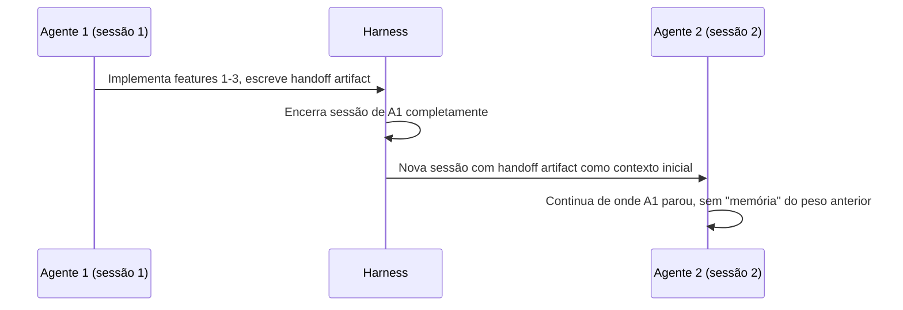

# Context Resets

> [!tip] Resumo em uma frase
> Context reset é o padrão de encerrar completamente a sessão de um agente
> e iniciar um novo com um artefato de handoff estruturado que carrega o
> estado necessário — resolvendo context anxiety sem preservar o "peso" de
> um contexto crescente.

## Problema

Em tarefas longas, duas forças degradam a qualidade do agente:
1. **Janela cheia**: o agente não consegue processar mais contexto
2. **[[Context Anxiety]]**: o agente começa a encerrar prematuramente ao
   *perceber* que o contexto está crescendo, mesmo antes de atingir o limite

A solução "natural" de compaction (resumir partes antigas do contexto) resolve
o problema de espaço mas **não resolve** context anxiety: o agente ainda
"lembra" que o contexto estava crescendo.

## Solução

**Artefato de handoff** (o que deve conter):
- Features implementadas até agora
- Features pendentes (do spec original)
- Estado atual da aplicação
- Bugs conhecidos e não resolvidos
- Decisões técnicas importantes tomadas
- Próximo passo imediato

O artefato deve ser **denso** (máxima informação, mínimo de tokens) — não um
dump completo do histórico, mas um briefing estruturado para um novo agente.

## Forças e trade-offs

| Força | Descrição |
|-------|-----------|
| ✅ Resolve context anxiety | Novo agente começa sem "memória" de pressão de contexto |
| ✅ Escalabilidade | Tarefas arbitrariamente longas divididas em sessões |
| ✅ Clean slate | Cada sessão começa "fresco", sem vieses acumulados |
| ⚠️ Overhead de handoff | Custo de tokens para criar e ler artefato |
| ⚠️ Perda de nuance | Informações sutis do contexto original podem se perder |
| ⚠️ Latência entre sessões | Tempo de inicializar nova sessão |
| ⚠️ Complexidade de orquestração | Harness precisa gerenciar criação e injeção de handoffs |

## Quando usar

- Modelos com context anxiety pronunciada (ex: Claude Sonnet 4.5)
- Tarefas que excedem a janela de contexto mesmo com compaction
- Quando a compaction sozinha não é suficiente para manter comportamento coerente

## Quando não usar

- Modelos mais novos com menos context anxiety (ex: Claude Opus 4.6)
- Tarefas que cabem em uma sessão com compaction normal
- Quando a perda de nuance do handoff prejudica a qualidade

## Exemplos das fontes

> [!example] Anthropic — Harness v1 (Sonnet 4.5)
> Sonnet 4.5 exibia context anxiety fortemente. A solução: após cada sprint,
> o generator escreve um artefato de handoff com estado completo. O harness
> encerra a sessão e inicia novo agente com o handoff como contexto.

> [!example] Anthropic — Harness v2 (Opus 4.6)
> Opus 4.6 reduziu context anxiety significativamente. Context resets foram
> removidos. O SDK cuida de compaction automática. O agente rodou 2+ horas
> contínuas sem degradação de qualidade.

## Conexões

- **Problema que resolve:** [[Context Anxiety]]
- **Artefato relacionado:** [[Contratos de Sprint]] (similar na estrutura)
- **Evolução:** [[Simplificação Iterativa do Harness]] — resets removidos em v2
- **Alternativa:** compaction (via [[Claude Agent SDK]])

## Referências

- [[Anthropic - Harness Design for Long-Running Apps]] — seção "Why naive implementations fall short"
