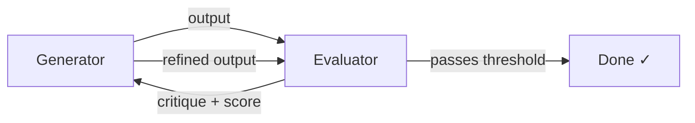

# Padrão Generator-Evaluator

> [!tip] Resumo em uma frase
> Separe o agente que produz outputs do agente que os avalia, criando um loop
> de feedback externo onde o evaluator critica o trabalho do generator com
> base em critérios concretos — em vez de pedir ao generator que avalie o
> próprio trabalho.

## Problema

O [[Self-Evaluation Failure Mode]] torna a auto-avaliação não confiável:
quando um agente avalia seu próprio trabalho, tende a elogiar mesmo outputs
mediocres. Isso é especialmente grave para tarefas subjetivas (design, UX)
onde não há teste binário.

Mesmo para tarefas objetivas (código funcional), agentes identificam bugs
mas depois "convencem a si mesmos" de que não são sérios — aprovando o trabalho
de qualquer forma.

## Solução

Dois agentes especializados em um loop de refinamento:

**Generator:**
- Recebe o prompt/spec e os critérios de avaliação
- Produz o output (código, design, feature)
- Usa a critique do evaluator para iterar

**Evaluator:**
- Recebe critérios concretos e o output do generator
- Inspeciona o output ativamente (ex: navega a UI via Playwright, não apenas
  analisa código estático)
- Produz score por critério + critique detalhada e acionável
- Decide se o output passa o threshold ou precisa de mais iterações

O evaluator é **calibrado separadamente** para ser cético — muito mais
tractável do que tornar o generator autocrítico. Ver [[Calibração do Evaluator]].

## Forças e trade-offs

| Força | Descrição |
|-------|-----------|
| ✅ Resolve auto-avaliação | Feedback externo é mais confiável que auto-crítica |
| ✅ Critérios explícitos | Força especificação do que "bom" significa |
| ✅ Loop de refinamento | Multiple iterações convergem para outputs melhores |
| ⚠️ Custo alto | 5-15 iterações × custo de tokens do evaluator |
| ⚠️ Latência | Cada ciclo leva tempo real (especialmente com Playwright) |
| ⚠️ Requer calibração | Evaluator out-of-the-box ainda é generoso |

## Quando usar

- Tarefas com critérios de qualidade difíceis de formalizar em testes binários
- Tarefas subjetivas onde o "bom" pode ser especificado mas não verificado
  automaticamente
- Quando a qualidade do output justifica o custo de múltiplas iterações
- Quando o generator está "no limite" do que consegue fazer sozinho

## Quando não usar

- Tarefas simples onde a qualidade é verificável por testes determinísticos
- Quando o custo de tokens e latência são proibitivos
- Quando o modelo é capaz o suficiente que o evaluator não adiciona lift real
  (ver [[Simplificação Iterativa do Harness]])

## Exemplos das fontes

> [!example] Anthropic — Frontend Design
> Generator cria HTML/CSS/JS → Evaluator navega a página via Playwright MCP,
> inspeciona visualmente, avalia 4 critérios (design quality, originality,
> craft, functionality), produz critique detalhada → Generator itera.
> 5-15 iterações. Uma run levou 4 horas.

> [!example] Anthropic — Full-Stack QA
> Generator implementa sprint → Evaluator usa Playwright para clicar no app
> como usuário real, testa endpoints, states de banco → Avalia contra critérios
> de produto, funcionalidade, design, qualidade de código → Generator corrige.

## Conexões

- **Conceito base:** [[Self-Evaluation Failure Mode]]
- **Padrões relacionados:** [[Arquitetura Planner-Generator-Evaluator]], [[Contratos de Sprint]]
- **Ferramentas que implementam:** [[Playwright MCP]], [[Claude Agent SDK]]
- **Como calibrar evaluator:** [[Calibração do Evaluator]]

## Referências

- [[Anthropic - Harness Design for Long-Running Apps]] — seções Frontend Design e Scaling to Full-Stack
