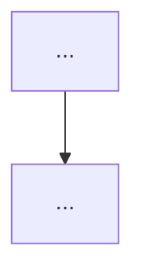
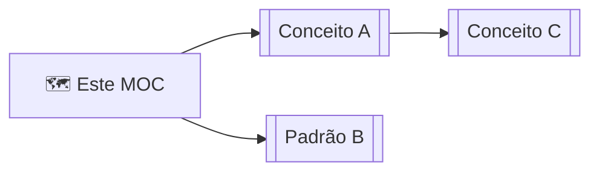
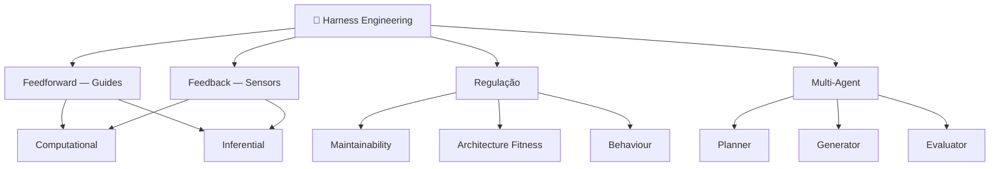

# Vault de Segundo Cérebro: Harness Engineering

> **Propósito:** Capturar, estruturar e interligar todo o conhecimento sobre
> Harness Engineering em um vault Obsidian, usando notas atômicas, wikilinks
> bidirecionais e bases dinâmicas — tornando o conhecimento navegável tanto
> por humanos quanto por agentes de IA.

---

## 1. Skills Obrigatórias

Antes de qualquer ação, verifique se as skills do `kepano/obsidian-skills`
estão instaladas. Elas definem a sintaxe correta para cada tipo de arquivo.

```bash
# Instalar via npx (recomendado)
npx skills add git@github.com:kepano/obsidian-skills.git

# Ou manualmente: copiar o conteúdo do repo em /.claude/ na raiz do vault
```

| Skill | Arquivo | Quando usar |
|-------|---------|-------------|
| `obsidian-markdown` | `skills/obsidian-markdown/SKILL.md` | Criar/editar qualquer `.md` |
| `obsidian-bases` | `skills/obsidian-bases/SKILL.md` | Criar/editar qualquer `.base` |
| `defuddle` | `skills/defuddle/SKILL.md` | Extrair conteúdo de URLs |
| `json-canvas` | `skills/json-canvas/SKILL.md` | Criar mapas visuais `.canvas` |

**Regra:** Leia o SKILL.md correspondente antes de criar qualquer arquivo de
cada tipo. Nunca invente sintaxe — siga a spec exata do skill.

---

## 2. Filosofia do Vault

### 2.1 Princípios de Segundo Cérebro

- **Notas atômicas** — uma nota = um conceito. Evite notas enciclopédicas.
- **Linking bidirecional** — toda nota menciona fontes e conceitos relacionados
  via `[[wikilinks]]`. O grafo de conexões é tão valioso quanto o conteúdo.
- **Status progressivo** — notas evoluem de `seedling` → `budding` → `evergreen`.
  Nunca delete; aprimore.
- **Agent-legible** — o vault deve ser navegável por agentes de IA. Estrutura,
  tags e links devem ser consistentes e mecânicamente verificáveis.

### 2.2 Inspiração no Padrão Harness

O próprio vault aplica os princípios que documenta:

- **Feedforward** → templates, schema de frontmatter e taxonomia de tags
  guiam a criação de novas notas antes de erros acontecerem.
- **Feedback** → `obsidian-bases` expõem notas sem links, tags incorretas ou
  status estagnado, permitindo autocorreção.
- **CLAUDE.md como mapa** → este arquivo é o "AGENTS.md" do vault: curto,
  com ponteiros para a fonte de verdade, não um manual monolítico.

---

## 3. Fontes Primárias

Extraia cada fonte com `defuddle` antes de criar notas de conteúdo.
Salve os arquivos extraídos em `06 - Fontes/` como rascunho inicial.

```bash
# Instalar defuddle se necessário
npm install -g defuddle

# Extrair as 3 fontes
defuddle parse https://openai.com/index/harness-engineering/ \
  --md -o "06 - Fontes/OpenAI - Harness Engineering.md"

defuddle parse https://www.anthropic.com/engineering/harness-design-long-running-apps \
  --md -o "06 - Fontes/Anthropic - Harness Design for Long-Running Apps.md"

defuddle parse https://martinfowler.com/articles/harness-engineering.html \
  --md -o "06 - Fontes/Martin Fowler - Harness Engineering for Coding Agent Users.md"
```

### Conteúdo obrigatório por fonte

**OpenAI — Harness Engineering** (`source/openai`)

| Conceito / Padrão | Nota atômica a criar |
|---|---|
| Filosofia "0 linhas de código humano" | `02 - Padrões/No-Human-Code Philosophy.md` |
| AGENTS.md como mapa (não enciclopédia) | `01 - Conceitos/AGENTS.md como Mapa.md` |
| Repository as system of record | `02 - Padrões/Repository as System of Record.md` |
| Progressive disclosure de contexto | `01 - Conceitos/Progressive Disclosure.md` |
| Legibilidade do agente (agent legibility) | `01 - Conceitos/Legibilidade do Agente.md` |
| Arquitetura em camadas com domínios | `02 - Padrões/Arquitetura em Camadas com Domínios.md` |
| Linters customizados como guardrails | `05 - Ferramentas/Linters Customizados.md` |
| Taste invariants / Golden Principles | `02 - Padrões/Golden Principles.md` |
| Garbage collection de entropia | `01 - Conceitos/Entropia e Garbage Collection.md` |
| Throughput e filosofia de merge ágil | `01 - Conceitos/Throughput e Merge Philosophy.md` |
| Chrome DevTools Protocol no agente | `05 - Ferramentas/Chrome DevTools Protocol.md` |
| Stack de observabilidade local por worktree | `05 - Ferramentas/Stack de Observabilidade.md` |
| Autonomia progressiva (feature → end-to-end) | `02 - Padrões/Autonomia Progressiva.md` |

**Anthropic — Harness Design for Long-Running Apps** (`source/anthropic`)

| Conceito / Padrão | Nota atômica a criar |
|---|---|
| Context anxiety | `01 - Conceitos/Context Anxiety.md` |
| Context resets vs compaction | `02 - Padrões/Context Resets.md` |
| Padrão Generator-Evaluator (GAN-inspired) | `02 - Padrões/Padrão Generator-Evaluator.md` |
| Critérios de design gradáveis | `01 - Conceitos/Critérios de Design Gradáveis.md` |
| Arquitetura Planner-Generator-Evaluator | `02 - Padrões/Arquitetura Planner-Generator-Evaluator.md` |
| Contratos de sprint | `02 - Padrões/Contratos de Sprint.md` |
| Self-evaluation failure mode | `01 - Conceitos/Self-Evaluation Failure Mode.md` |
| Calibração do evaluator com few-shot | `02 - Padrões/Calibração do Evaluator.md` |
| Simplificação iterativa do harness | `02 - Padrões/Simplificação Iterativa do Harness.md` |
| Playwright MCP para QA | `05 - Ferramentas/Playwright MCP.md` |
| Claude Agent SDK | `05 - Ferramentas/Claude Agent SDK.md` |

**Martin Fowler — Harness Engineering for Coding Agent Users** (`source/fowler`)

| Conceito / Padrão | Nota atômica a criar |
|---|---|
| Agent = Model + Harness | `01 - Conceitos/Agent = Model + Harness.md` |
| O que é um Harness | `01 - Conceitos/O que é um Harness.md` |
| Feedforward e Feedback | `01 - Conceitos/Feedforward e Feedback.md` |
| Controles Computacionais vs Inferenciais | `01 - Conceitos/Controles Computacionais vs Inferenciais.md` |
| O Steering Loop | `01 - Conceitos/O Steering Loop.md` |
| Timing — keep quality left | `01 - Conceitos/Timing - Keep Quality Left.md` |
| Maintainability Harness | `03 - Regulação/Maintainability Harness.md` |
| Architecture Fitness Harness | `03 - Regulação/Architecture Fitness Harness.md` |
| Behaviour Harness | `03 - Regulação/Behaviour Harness.md` |
| Harnessability | `01 - Conceitos/Harnessability.md` |
| Ambient Affordances | `01 - Conceitos/Ambient Affordances.md` |
| Harness Templates | `02 - Padrões/Harness Templates.md` |
| Lei de Ashby (Requisite Variety) | `01 - Conceitos/Lei de Ashby.md` |
| O papel do humano | `01 - Conceitos/O Papel do Humano.md` |
| Ralph Wiggum Loop | `02 - Padrões/Ralph Wiggum Loop.md` |
| Context Engineering (relação) | `01 - Conceitos/Context Engineering.md` |

---

## 4. Estrutura do Vault

Crie exatamente esta estrutura de pastas. Nenhuma pasta adicional sem justificativa.

```
Harness Engineering Brain/
│
├── CLAUDE.md                              ← este arquivo (não editar sem necessidade)
├── AGENTS.md                              ← mapa curto do vault para agentes
│
├── 00 - MOCs/                             ← Maps of Content (índices navegáveis)
│   ├── 🗺️ Harness Engineering.md         ← MOC raiz — ponto de entrada
│   ├── 🗺️ Conceitos.md                   ← índice de todos os conceitos
│   ├── 🗺️ Padrões.md                     ← índice de todos os padrões
│   ├── 🗺️ Regulação.md                   ← índice das 3 dimensões de regulação
│   └── 🗺️ Fontes.md                      ← índice das fontes primárias
│
├── 01 - Conceitos/                        ← notas atômicas de conceitos fundamentais
├── 02 - Padrões/                          ← padrões de design e implementação
├── 03 - Regulação/                        ← as 3 dimensões de regulação (Fowler)
│   ├── Maintainability Harness.md
│   ├── Architecture Fitness Harness.md
│   └── Behaviour Harness.md
│
├── 04 - Agentes/                          ← os 3 tipos de agentes especializados
│   ├── Planner Agent.md
│   ├── Generator Agent.md
│   └── Evaluator Agent.md
│
├── 05 - Ferramentas/                      ← ferramentas e MCPs usados nos harnesses
├── 06 - Fontes/                           ← 1 nota por artigo-fonte (geradas por defuddle)
├── 07 - Fleeting/                         ← notas temporárias, sem estrutura exigida
│
├── Daily Notes/                           ← notas diárias (YYYY-MM-DD.md)
│
└── Bases/                                 ← dashboards dinâmicos Obsidian Bases
    ├── Todos os Conceitos.base
    ├── Todos os Padrões.base
    ├── Tracker de Fontes.base
    └── Dashboard Principal.base
```

### AGENTS.md (criar junto com a estrutura)

O arquivo `AGENTS.md` deve ser curto (~80 linhas) e servir como mapa de entrada
para agentes. Conteúdo mínimo:

```markdown
# AGENTS.md — Harness Engineering Brain

## Objetivo
Vault de segundo cérebro sobre Harness Engineering.

## Mapa rápido
- Conceitos fundamentais → `01 - Conceitos/`
- Padrões de implementação → `02 - Padrões/`
- Dimensões de regulação → `03 - Regulação/`
- Agentes especializados → `04 - Agentes/`
- Ferramentas e MCPs → `05 - Ferramentas/`
- Artigos-fonte → `06 - Fontes/`
- Dashboards → `Bases/`
- Entrada principal → `[[🗺️ Harness Engineering]]`

## Convenções
- Toda nota tem frontmatter completo (ver CLAUDE.md §5)
- Tags seguem taxonomia em CLAUDE.md §6
- Wikilinks são preferidos a caminhos absolutos
- Status deve ser atualizado a cada edição significativa

## Fontes de verdade
- Schema de notas → CLAUDE.md §5
- Taxonomia de tags → CLAUDE.md §6
- Templates → CLAUDE.md §7
- Specs dos Bases → CLAUDE.md §8
```

---

## 5. Schema de Frontmatter

Toda nota do vault (exceto `07 - Fleeting/` e `Daily Notes/`) deve ter este
frontmatter. Use **exatamente** estes campos — não invente outros sem atualizar
este schema.

```yaml
---
title: "Nome da Nota"
type: concept | pattern | source | agent | tool | regulation | moc
tags:
  - harness-engineering          # tag mestre — sempre presente
  - <categoria>                  # ver taxonomia §6
status: seedling | budding | evergreen
sources:
  - "[[Nome da Nota de Fonte]]"  # wikilinks para notas em 06 - Fontes/
related:
  - "[[Conceito Relacionado]]"   # wikilinks para notas relacionadas no vault
created: YYYY-MM-DD
modified: YYYY-MM-DD
---
```

### Regras de frontmatter

- `title` deve coincidir com o nome do arquivo (sem extensão).
- `type` é obrigatório e controla os filtros dos `.base` files.
- `tags` começa sempre com `harness-engineering`, seguido das tags específicas.
- `status: seedling` para notas recém-criadas. Promova conforme critérios em §9.
- `sources` e `related` usam wikilinks (`[[...]]`), não caminhos nem URLs.
- `created` e `modified` são datas ISO 8601 (`YYYY-MM-DD`).

---

## 6. Taxonomia de Tags

### Nível 1 — Tag mestre
```
harness-engineering
```

### Nível 2 — Tipo de nota
```
concept | pattern | source | agent | tool | regulation | moc
```

### Nível 3 — Categorias temáticas

**Controle (Fowler)**
```
feedforward
feedback
computational
inferential
```

**Dimensões de regulação**
```
regulation/maintainability
regulation/architecture
regulation/behaviour
```

**Gestão de contexto (Anthropic)**
```
context/anxiety
context/reset
context/compaction
context/engineering
```

**Arquitetura multi-agente**
```
multi-agent
single-agent
agent/planner
agent/generator
agent/evaluator
```

**Qualidade e manutenção**
```
quality/entropy
quality/golden-principles
quality/harnessability
quality/ambient-affordances
```

**Timing no ciclo de mudança**
```
timing/pre-commit
timing/post-integration
timing/continuous
```

**Fonte de origem**
```
source/openai
source/anthropic
source/fowler
```

**Status de maturidade**
```
status/seedling
status/budding
status/evergreen
```

---

## 7. Templates por Tipo de Nota

### 7.1 Template: `concept` (conceito atômico)

```markdown
---
title: "Nome do Conceito"
type: concept
tags:
  - harness-engineering
  - concept
  - <categoria-temática>
status: seedling
sources:
  - "[[Nome da Fonte]]"
related:
  - "[[Conceito Relacionado A]]"
  - "[[Conceito Relacionado B]]"
created: YYYY-MM-DD
modified: YYYY-MM-DD
---

# Nome do Conceito

> [!abstract] Definição em uma frase
> <definição concisa do conceito>

## O que é

<2-3 parágrafos explicando o conceito. Foque no "o quê" e "por quê",
não no "como" — isso pertence às notas de padrão.>

## Por que importa em Harness Engineering

<Conexão explícita com o domínio do vault. Por que este conceito é
relevante para engenheiros que constroem harnesses?>

## Exemplos práticos

- <Exemplo concreto do contexto das fontes>
- <Exemplo de aplicação em um harness real>

## Conexões

- **Conceito pai:** [[<conceito mais amplo>]]
- **Conceitos filhos:** [[<especialização A>]], [[<especialização B>]]
- **Padrões que aplicam este conceito:** [[<Padrão X>]], [[<Padrão Y>]]
- **Contrasta com:** [[<Conceito Oposto ou Alternativo>]]

## Referências

- [[<Nota de Fonte>]] — <trecho relevante ou seção>
```

---

### 7.2 Template: `pattern` (padrão de implementação)

```markdown
---
title: "Nome do Padrão"
type: pattern
tags:
  - harness-engineering
  - pattern
  - <categoria-temática>
status: seedling
sources:
  - "[[Nome da Fonte]]"
related:
  - "[[Conceito Base]]"
  - "[[Padrão Relacionado]]"
created: YYYY-MM-DD
modified: YYYY-MM-DD
---

# Nome do Padrão

> [!tip] Resumo em uma frase
> <O que este padrão faz e quando usar>

## Problema

<Qual situação ou falha este padrão resolve? Seja específico sobre
as condições que tornam o padrão necessário.>

## Solução

<Como o padrão funciona. Use listas, diagramas Mermaid ou código
quando ajudar a clareza.>



## Forças e trade-offs

| Força | Descrição |
|-------|-----------|
| ✅ <benefício> | <explicação> |
| ⚠️ <custo> | <explicação> |

## Quando usar

- <Condição 1 que justifica o padrão>
- <Condição 2>

## Quando não usar

- <Condição que torna o padrão desnecessário ou prejudicial>

## Exemplos das fontes

> [!example] <Fonte: OpenAI/Anthropic/Fowler>
> <Citação ou descrição do uso real nas fontes>

## Conexões

- **Conceito base:** [[<Conceito que fundamenta o padrão>]]
- **Padrões relacionados:** [[<Padrão A>]], [[<Padrão B>]]
- **Ferramentas que implementam:** [[<Ferramenta X>]]

## Referências

- [[<Nota de Fonte>]] — <seção relevante>
```

---

### 7.3 Template: `source` (nota de fonte primária)

```markdown
---
title: "Título do Artigo"
type: source
tags:
  - harness-engineering
  - source
  - source/<openai|anthropic|fowler>
status: budding
sources: []
related:
  - "[[🗺️ Fontes]]"
created: YYYY-MM-DD
modified: YYYY-MM-DD
---

# Título do Artigo

## Metadata

| Campo | Valor |
|-------|-------|
| Autor | <nome> |
| Publicação | <organização> |
| Data | <data de publicação> |
| URL | <url original> |
| Extraído com | `defuddle parse <url> --md` |

## Sumário executivo

<3-5 parágrafos capturando a tese central do artigo e seus argumentos
principais. Escreva para um leitor que não vai ler o artigo completo.>

## Conceitos e padrões introduzidos

<Liste com wikilinks os conceitos e padrões que esta fonte introduz
ou é a referência primária:>

- [[Agent = Model + Harness]]
- [[Feedforward e Feedback]]
- ...

## Trechos de destaque

> [!quote] <Seção do artigo>
> "<citação literal mais importante do artigo>"

> [!quote] <Outra seção>
> "<segunda citação relevante>"

## Perguntas abertas

<Questões que o artigo levanta mas não responde completamente,
ou áreas onde diverge das outras fontes.>

- <Pergunta 1>
- <Pergunta 2>

## Conexões com outras fontes

- **Complementa:** [[<Outra nota de fonte>]] em <aspecto>
- **Contrasta com:** [[<Outra nota de fonte>]] em <aspecto>
```

---

### 7.4 Template: `moc` (Map of Content)

```markdown
---
title: "🗺️ Nome do MOC"
type: moc
tags:
  - harness-engineering
  - moc
status: evergreen
sources: []
related: []
created: YYYY-MM-DD
modified: YYYY-MM-DD
---

# 🗺️ Nome do MOC

> [!info] Sobre este mapa
> <Uma frase descrevendo o escopo deste MOC.>

## Dashboard

![[<Base relevante>.base]]

## <Grupo A>

- [[Nota 1]] — <descrição de uma linha>
- [[Nota 2]] — <descrição de uma linha>

## <Grupo B>

- [[Nota 3]] — <descrição de uma linha>

## Visão geral de conexões



## Notas relacionadas

- [[Outro MOC]] — <relação>
```

---

### 7.5 Template: `regulation` (dimensão de regulação)

```markdown
---
title: "Nome do Harness de Regulação"
type: regulation
tags:
  - harness-engineering
  - regulation
  - regulation/<maintainability|architecture|behaviour>
status: seedling
sources:
  - "[[Martin Fowler - Harness Engineering for Coding Agent Users]]"
related:
  - "[[Feedforward e Feedback]]"
  - "[[🗺️ Regulação]]"
created: YYYY-MM-DD
modified: YYYY-MM-DD
---

# Nome do Harness de Regulação

> [!abstract] O que regula
> <O que esta dimensão de regulação governa no codebase/sistema>

## Objetivo

<Por que esta dimensão de regulação existe. Qual problema resolve.>

## Guides (Feedforward)

| Guide | Tipo | Exemplo |
|-------|------|---------|
| <Guide 1> | Computational / Inferential | <exemplo concreto> |
| <Guide 2> | Computational / Inferential | <exemplo concreto> |

## Sensors (Feedback)

| Sensor | Tipo | Timing | Exemplo |
|--------|------|--------|---------|
| <Sensor 1> | Computational | Pre-commit | <exemplo> |
| <Sensor 2> | Inferential | Post-integration | <exemplo> |

## Limitações atuais

<O que esta regulação ainda não consegue capturar de forma confiável.>

## Conexões

- **Conceito base:** [[Feedforward e Feedback]]
- **Complementa:** [[<Outra dimensão de regulação>]]
- **Ferramentas:** [[<Ferramenta X>]]

## Referências

- [[Martin Fowler - Harness Engineering for Coding Agent Users]]
```

---

## 8. Specs dos Obsidian Bases

Antes de criar qualquer `.base`, leia o skill `obsidian-bases/SKILL.md`.
Crie os 4 arquivos a seguir em `Bases/`.

### 8.1 `Todos os Conceitos.base`

```yaml
filters:
  and:
    - 'type == "concept"'
    - 'file.ext == "md"'

formulas:
  days_old: '(now() - file.ctime).days.round(0)'
  maturity_icon: 'if(status == "evergreen", "🌳", if(status == "budding", "🌿", "🌱"))'

properties:
  formula.maturity_icon:
    displayName: ""
  formula.days_old:
    displayName: "Dias"
  status:
    displayName: "Status"

views:
  - type: table
    name: "Por Status"
    groupBy:
      property: status
      direction: ASC
    order:
      - formula.maturity_icon
      - file.name
      - tags
      - formula.days_old
      - file.mtime
    summaries:
      formula.days_old: Average

  - type: cards
    name: "Galeria"
    order:
      - formula.maturity_icon
      - file.name
      - status
```

### 8.2 `Todos os Padrões.base`

```yaml
filters:
  and:
    - 'type == "pattern"'
    - 'file.ext == "md"'

formulas:
  days_old: '(now() - file.ctime).days.round(0)'
  maturity_icon: 'if(status == "evergreen", "🌳", if(status == "budding", "🌿", "🌱"))'

properties:
  formula.maturity_icon:
    displayName: ""
  formula.days_old:
    displayName: "Dias"

views:
  - type: cards
    name: "Galeria de Padrões"
    order:
      - formula.maturity_icon
      - file.name
      - status
      - tags

  - type: table
    name: "Tabela"
    order:
      - formula.maturity_icon
      - file.name
      - status
      - formula.days_old
      - file.mtime
```

### 8.3 `Tracker de Fontes.base`

```yaml
filters:
  and:
    - 'type == "source"'
    - 'file.ext == "md"'

formulas:
  days_since_extracted: '(now() - file.ctime).days.round(0)'
  status_icon: 'if(status == "evergreen", "✅", if(status == "budding", "🔄", "⏳"))'

properties:
  formula.status_icon:
    displayName: ""
  formula.days_since_extracted:
    displayName: "Dias desde extração"
  status:
    displayName: "Maturidade"

views:
  - type: table
    name: "Fontes"
    order:
      - formula.status_icon
      - file.name
      - status
      - formula.days_since_extracted
      - file.mtime
```

### 8.4 `Dashboard Principal.base`

```yaml
filters:
  and:
    - 'file.ext == "md"'
    - 'file.hasTag("harness-engineering")'

formulas:
  days_old: '(now() - file.mtime).days.round(0)'
  type_icon: >
    if(type == "moc", "🗺️",
    if(type == "concept", "💡",
    if(type == "pattern", "🔧",
    if(type == "regulation", "⚖️",
    if(type == "source", "📄",
    if(type == "agent", "🤖",
    if(type == "tool", "🛠️", "📝")))))))
  maturity_icon: 'if(status == "evergreen", "🌳", if(status == "budding", "🌿", "🌱"))'

properties:
  formula.type_icon:
    displayName: ""
  formula.maturity_icon:
    displayName: ""
  formula.days_old:
    displayName: "Dias sem edição"
  type:
    displayName: "Tipo"
  status:
    displayName: "Status"

views:
  - type: table
    name: "Modificadas Recentemente"
    limit: 20
    order:
      - formula.type_icon
      - formula.maturity_icon
      - file.name
      - type
      - status
      - formula.days_old
      - file.mtime

  - type: table
    name: "Seedlings para Promover"
    filters:
      and:
        - 'status == "seedling"'
        - 'if(days_old, days_old > 3, false)'
    order:
      - formula.type_icon
      - file.name
      - formula.days_old
```

---

## 9. Workflow de Criação de Notas

Siga esta sequência ao criar qualquer nova nota no vault:

```
1. EXTRAIR
   └── defuddle parse <url> --md → salvar em 06 - Fontes/
       (apenas para notas de fonte; pule para notas internas)

2. IDENTIFICAR
   └── Determinar: é um conceito, padrão, ferramenta, agente ou regulação?
   └── Verificar se já existe nota similar (buscar por wikilinks e tags)

3. CRIAR
   └── Copiar o template correto (§7) para a pasta adequada
   └── Preencher frontmatter completo (title, type, tags, status: seedling)
   └── Escrever conteúdo mínimo: definição + por que importa + 1 exemplo

4. LINKAR
   └── Adicionar [[wikilinks]] para conceitos mencionados no corpo
   └── Atualizar `related` no frontmatter
   └── Adicionar link para esta nota no MOC relevante em 00 - MOCs/
   └── Verificar se o MOC tem esta nota listada

5. VERIFICAR
   └── Frontmatter está completo? (todos os campos obrigatórios)
   └── Tags incluem `harness-engineering` como primeira tag?
   └── Wikilinks para notas que ainda não existem? → criar notas stub
   └── `modified` atualizado para hoje?

6. PROMOVER (quando a nota for revisada e expandida)
   └── seedling → budding: tem definição clara, exemplos e ≥3 conexões
   └── budding → evergreen: aborda o conceito exaustivamente, todas as
       conexões relevantes linkadas, conteúdo revisado com as 3 fontes
```

---

## 10. Critérios de Promoção de Status

### `seedling` → `budding`
- [ ] Definição clara em uma frase (callout `abstract`)
- [ ] Explicação em ao menos 2 parágrafos
- [ ] Ao menos 1 exemplo prático das fontes
- [ ] Ao menos 3 wikilinks no corpo da nota
- [ ] `sources` no frontmatter preenchido
- [ ] Nota listada no MOC relevante

### `budding` → `evergreen`
- [ ] Todos os critérios `budding` cumpridos
- [ ] Conteúdo cruzado com as 3 fontes primárias
- [ ] Seção "Conexões" completa (pai, filhos, padrões, contraste)
- [ ] Sem wikilinks quebrados (todos os `[[...]]` têm nota correspondente)
- [ ] Revisado e atualizado após leitura de nova fonte relevante
- [ ] Diagramas Mermaid quando a estrutura beneficia visualização

---

## 11. MOC Raiz — Estrutura Obrigatória

O arquivo `00 - MOCs/🗺️ Harness Engineering.md` é o ponto de entrada do vault.
Deve conter, na ordem:

1. **Callout `info`** com a definição de Harness Engineering em 2-3 linhas
2. **Embed do Dashboard Principal** (`![[Dashboard Principal.base]]`)
3. **Seção "Fundamentos"** — links para os ~5 conceitos mais centrais
4. **Seção "Frameworks"** — links para as 3 dimensões de regulação (Fowler)
5. **Seção "Padrões"** — links para os padrões de implementação mais importantes
6. **Seção "Fontes Primárias"** — links para as 3 notas de fonte
7. **Mermaid de visão geral** — grafo simplificado das relações centrais

Exemplo de Mermaid obrigatório no MOC raiz:



---

## 12. Manutenção Contínua (Doc-Gardening)

Aplique os princípios do vault ao próprio vault — conforme os artigos-fonte descrevem:

### Verificações periódicas

Execute as seguintes verificações regularmente (ou quando o vault crescer):

```bash
# Verificar notas sem frontmatter completo
# (use Obsidian Bases com filtro: file.hasTag("harness-engineering") sem type)

# Verificar notas seedling com mais de 14 dias sem promoção
# (Dashboard Principal.base → aba "Seedlings para Promover")

# Verificar MOCs desatualizados (notas sem link em nenhum MOC)
# (use file.backlinks para detectar notas órfãs)
```

### Regras de garbage collection

- **Notas em `07 - Fleeting/`** com mais de 7 dias → promover para pasta correta
  ou deletar conscientemente.
- **Wikilinks quebrados** → criar stub imediatamente ou remover o link.
- **Tags fora da taxonomia** → corrigir ou atualizar a taxonomia em CLAUDE.md §6.
- **Frontmatter incompleto** → nunca deixar nota sem `type` e `status`.

### Quando uma nova fonte for adicionada

1. Extrair com `defuddle parse <url> --md -o "06 - Fontes/<nome>.md"`
2. Criar nota de fonte com template §7.3
3. Identificar conceitos novos → criar notas atômicas stub
4. Atualizar `00 - MOCs/🗺️ Fontes.md` com link para a nova fonte
5. Atualizar `Tracker de Fontes.base` (automático via propriedade `type: source`)

---

## 13. Referências Externas

| Recurso | URL | Propósito |
|---------|-----|-----------|
| Obsidian Skills (kepano) | https://github.com/kepano/obsidian-skills | Skills base do vault |
| Agent Skills Spec | https://agentskills.io/specification | Spec do formato SKILL.md |
| OpenAI — Harness Engineering | https://openai.com/index/harness-engineering/ | Fonte primária |
| Anthropic — Harness Design | https://www.anthropic.com/engineering/harness-design-long-running-apps | Fonte primária |
| Martin Fowler — Harness Engineering | https://martinfowler.com/articles/harness-engineering.html | Fonte primária |
| Obsidian Flavored Markdown | https://help.obsidian.md/obsidian-flavored-markdown | Referência de sintaxe |
| Obsidian Bases Syntax | https://help.obsidian.md/bases/syntax | Referência de Bases |
| Defuddle CLI | https://github.com/kepano/defuddle | Extração de páginas web |
